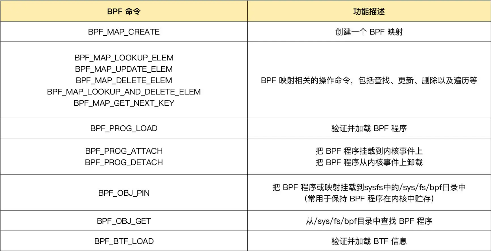
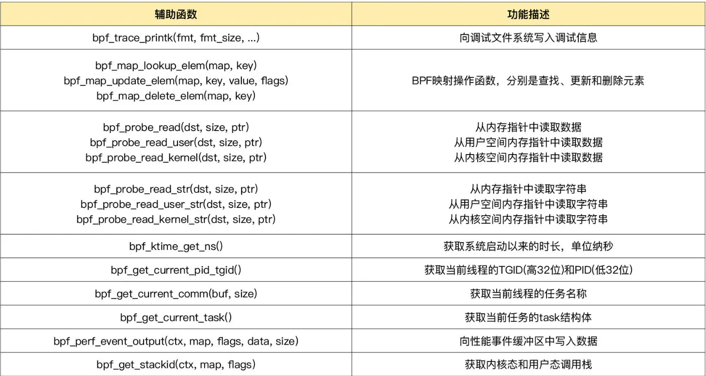
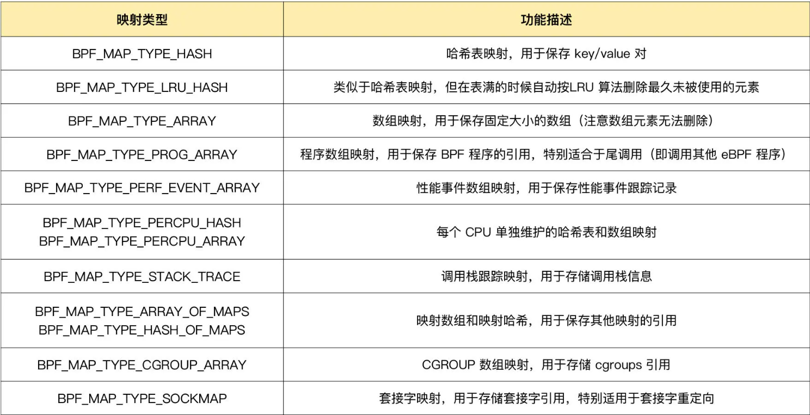

# learn libbpfgo

## Install packages on Ubuntu 22.04

```sh
sudo apt-get update
sudo apt-get install golang-go
sudo apt-get install libbpf-dev make clang llvm libelf-dev
sudo apt-get install linux-tools-5.15.0-39-generic
```

## Run

```sh
make
./hello-world
```

## install [bpftrace](https://github.com/iovisor/bpftrace)

```sh
sudo apt-get install -y bpftrace
```

```sh
# 查询所有内核插桩和跟踪点
sudo bpftrace -l

# 使用通配符查询所有的系统调用跟踪点
sudo bpftrace -l 'tracepoint:syscalls:*'

# 使用通配符查询所有名字包含"execve"的跟踪点
sudo bpftrace -l '*execve*'
```

```sh
# 查询execve入口参数格式
$ sudo bpftrace -lv tracepoint:syscalls:sys_enter_execve

# 查询execve返回值格式
$ sudo bpftrace -lv tracepoint:syscalls:sys_exit_execve
```

## bpf program type

[kernel code](https://elixir.bootlin.com/linux/v5.13/source/include/uapi/linux/bpf.h#L908)

```sh
bpftool feature probe | grep program_type
```

## bpf system call

[kernel code](https://elixir.bootlin.com/linux/v5.13/source/include/uapi/linux/bpf.h#L828)




## bpf helper function

[kernel code](https://elixir.bootlin.com/linux/v5.13/source/include/uapi/linux/bpf.h#L1463)



## bpf map 

[kernel code](https://elixir.bootlin.com/linux/v5.13/source/include/uapi/linux/bpf.h#L867)


